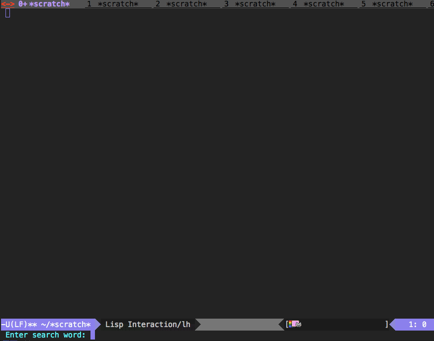

# hatena-keyword-mode.el

## 概要

hatenaのkeyword APIを利用して、検索ワードの情報を見ることができます


## スクリーンショット




## 必要条件

* Emacs 23 or higher


## 使い方

```lisp
(require 'hatena-keyword-mode)
```

M-x hatena-keyword-start
